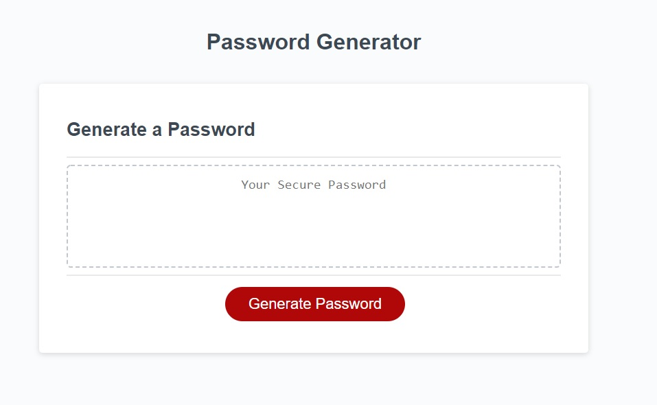
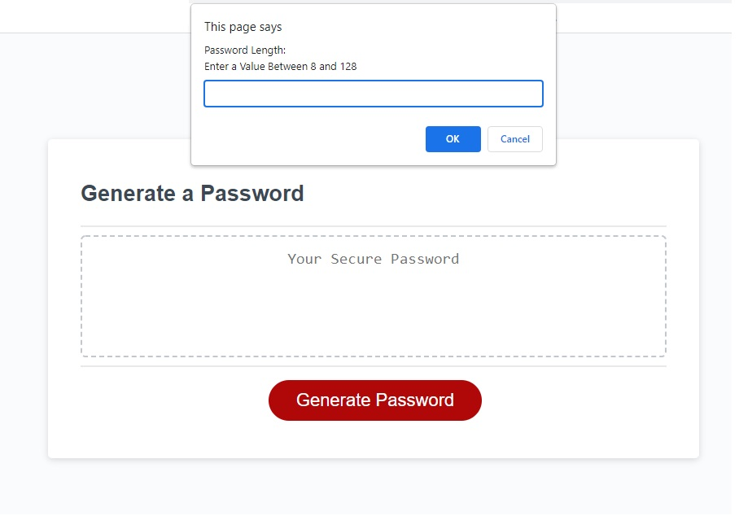
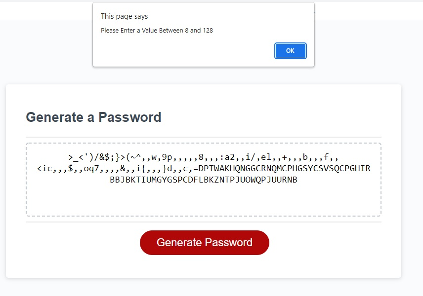
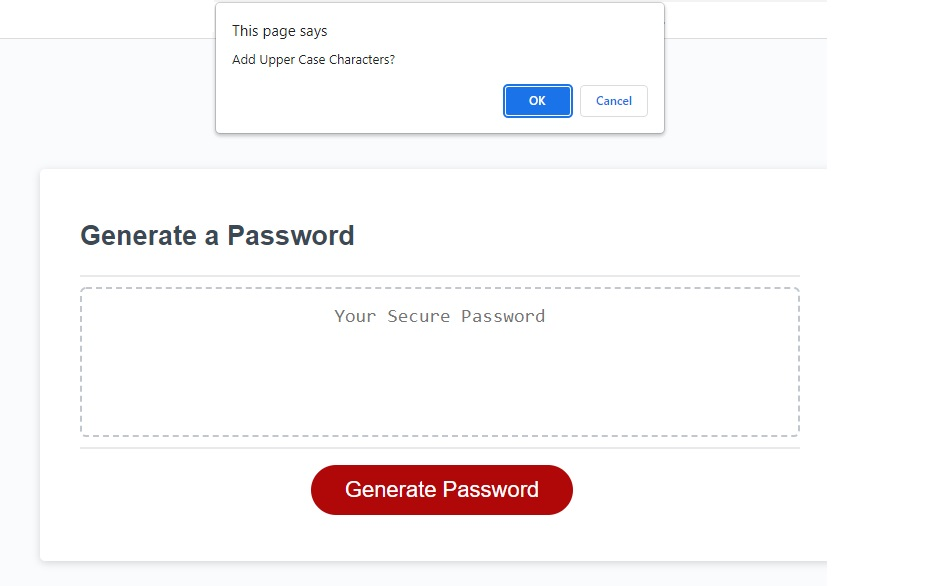
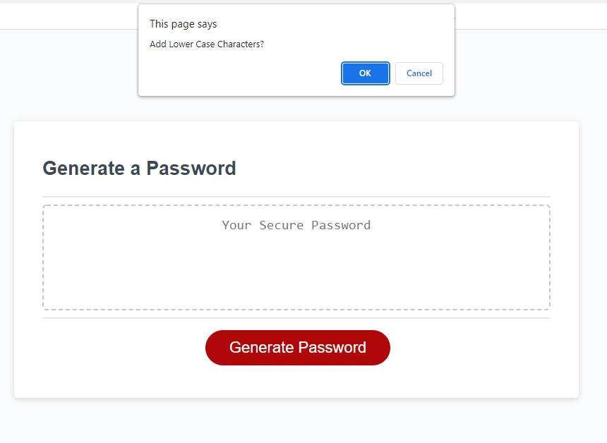
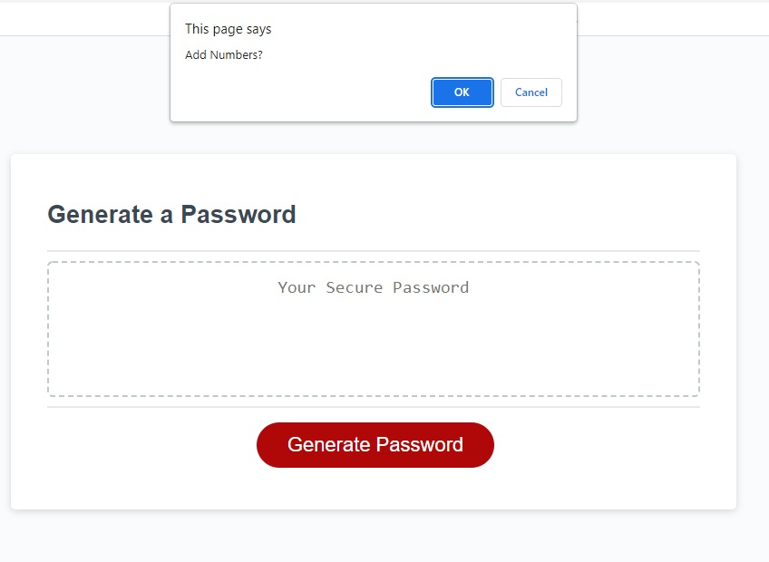
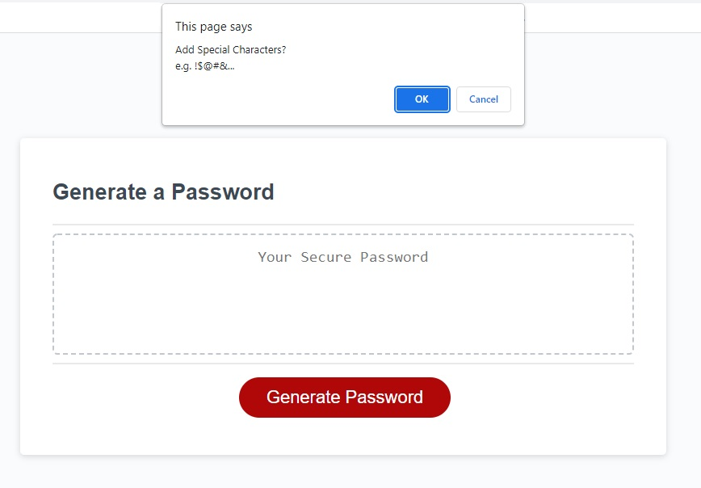
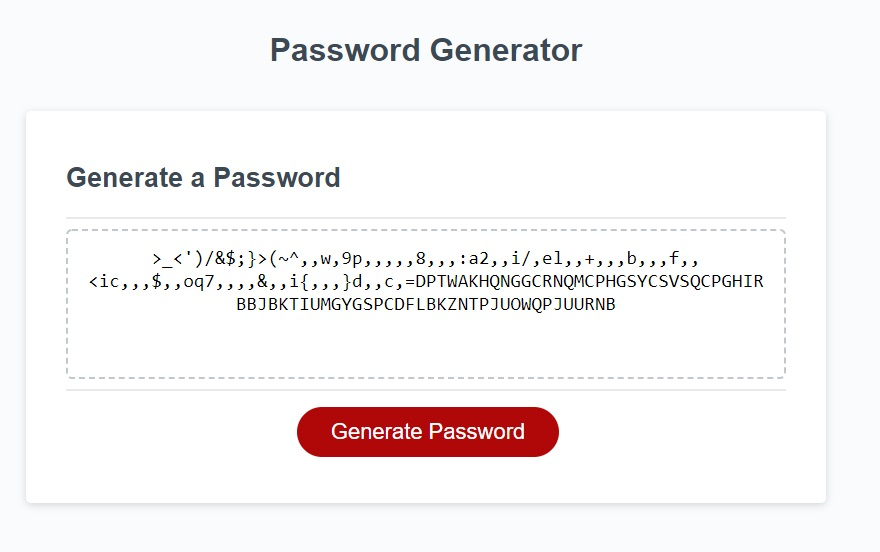

## Password Generator

This is a basic password generator that utilizes basic javascript elements to generate and display a (somewhat) random password.

## Purpose and Criteria
The main focus of the activity was to understand how to create/edit objects and arrays, and how to utilize them in various functions. 

In this case specifically, we are using javascript functions to generate and display a password that contains some or all of the following criteria: 

* Upper Case Alphabet Characters 

* Lower Case Alphabet Characters 

* Numeric Characters

* Special Characters (e.g. @#%...)

## Expected Behavior

